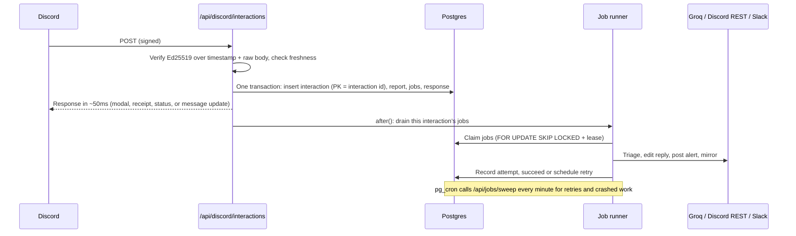

# Slash Bot

A Discord bot for problem reports and server status, plus a dashboard for the admins who run it.

- **`/report`** opens a short form (title, details, severity, category). The report gets AI
  triage, is posted to the server's alert channel with **Acknowledge / Resolve** buttons, and is
  mirrored to a Slack or Discord webhook.
- **`/status`** shows how the bot is set up in that server and whether deliveries are healthy,
  with a **Refresh** button.
- **The dashboard** (behind login) shows a live log of every command and every action taken for
  it, including retries and failures. It also has per-server rules and settings.

The bot runs entirely on Discord's HTTP interactions: no gateway connection, nothing to keep
awake.

**Live:** https://discord-slash-bot-six.vercel.app
**Reviewer guide:** [REVIEWING.md](REVIEWING.md)

## How it works



### The interaction path

1. The route reads the body as **raw text** and verifies `X-Signature-Ed25519` over
   `X-Signature-Timestamp + body` with the app's public key, before anything is parsed.
   Missing or malformed headers, bad signatures and stale timestamps get a `401` with a
   specific error code. Signed but malformed JSON or wrong-shaped payloads get a `400`.
2. PING gets `{"type":1}`.
3. Everything else goes through one database transaction whose **first statement** is
   `INSERT INTO interactions ... ON CONFLICT (id) DO NOTHING`. The interaction id is the
   primary key, so that table is the dedupe ledger:
   - The first delivery goes on to create the report and its jobs, then stores the exact
     response it's about to send.
   - A duplicate, even one arriving concurrently, blocks on the key until the first
     transaction commits. It then gets the **stored response** back and does nothing else,
     much like an idempotency key.
4. The response goes out straight away. Nothing slow happens before it: no AI, no webhooks,
   no Discord REST calls. Locally the handler takes 10 to 50 ms.
5. Next's `after()` keeps the function alive to run that interaction's jobs.

For `/report`, the immediate response is the acknowledgment: a private "Report #N received"
receipt. The follow-up edits that same message through the interaction webhook
(`PATCH /messages/@original`) once triage is done. That's the same shape as a deferred
response, except the user sees something useful straight away.

If the database write itself fails, the route returns `500` and nothing is half-recorded.
Discord then shows the user that the interaction failed, instead of the app pretending it
worked. Once the write has committed, a crash or redeploy can't lose the work: the jobs are
already in Postgres, and the minute sweep picks them up.

### Jobs

The work that happens after the response is stored as rows in `jobs`, a database-backed
outbox, written in the same transaction as the interaction. Nothing lives only in memory.

| Job | What it does | Attempts | Backoff |
|---|---|---|---|
| `triage` | Groq structured output (summary, category, severity, tags, next step), validated with zod | 3 | 2s, 6s |
| `reply` | Edits the reporter's receipt with the result (`PATCH .../messages/@original`) | 5 | from 3s |
| `channel_post` | Posts the report to the alert channel with buttons | 8 | 5s ×3, capped at 30 min |
| `mirror` | Sends the Slack or Discord webhook notification | 8 | 5s ×3, capped at 30 min |

- **Ordering.** When triage succeeds, or gives up, it enqueues `reply`, `channel_post` and
  `mirror` in the same transaction that marks it done. If the AI is down the report still
  goes out, marked "AI unavailable".
- **Idempotency.** Jobs are unique on `(interaction_id, kind)`, so re-running a step can't
  create a second side effect.
- **Claiming.** Jobs are claimed with `FOR UPDATE SKIP LOCKED` and a 60s lease. The
  post-response drain and the minute sweep can run at the same time without ever picking up
  the same job. A worker that dies mid-job loses its lease and the job is picked up again.
- **Fencing.** Results are only recorded if the job is still on the attempt number the
  worker claimed, so a slow, expired worker can't overwrite a newer attempt.
- **Error classes.** Network errors, timeouts, `408`, `429` (honouring `Retry-After`) and
  `5xx` are retryable. Other `4xx` responses are permanent and get a readable code, such as
  `mirror_webhook_not_found`, `missing_channel_access` or `interaction_token_expired`.
  Every attempt is written to `job_attempts` and shown in the dashboard.
- **Nothing is lost silently.** A job that exhausts its attempts is marked `failed`, stays
  visible under **Needs attention**, and can be retried from the dashboard.
- **The sweep.** Vercel's free plan only allows daily cron jobs, so Supabase `pg_cron` +
  `pg_net` call `/api/jobs/sweep` every minute (see `supabase/cron.sql`). A daily Vercel cron
  is kept as a backstop.

**Delivery is at-least-once.** One narrow window remains: a crash after an external call
succeeds but before the success is recorded. For channel posts, Discord's
`nonce` + `enforce_nonce` drops the second copy. The reply is an idempotent `PATCH`.
Slack and Discord webhooks have no idempotency key, so a mirror message could in theory be
duplicated in that window. I accepted that rather than risk dropping one.

### Security

- **Replay protection.** Timestamps more than **5 minutes** away from server time are
  rejected even with a valid signature. Discord doesn't define a window; 5 minutes absorbs
  clock skew and is well inside the 15-minute life of an interaction token. Inside the
  window, a replayed request hits the primary key and changes nothing.
- **The dashboard.** Email/password accounts via Better Auth with database sessions and
  rate-limited sign-in. There is no public sign-up. Every page, server action and API route
  checks the session server-side. `proxy.ts` only does a fast redirect for visitors with no
  cookie at all.
- **Server isolation.** Every guild-scoped query goes through
  `requireGuildAdmin(userId, guildId)`, which joins on `guild_admins`. Another admin's server
  returns the same 404 as a server that doesn't exist. Button clicks look reports up by id
  **and** guild, so a crafted `custom_id` can't reach another server's report.
- **Proving ownership.** A server gets connected through Discord's bot-install OAuth flow.
  The guild id comes from Discord's token exchange, not the query string, and there's a
  `state` cookie against CSRF. Discord only allows adding a bot to a server where you have
  Manage Server, and that's what makes you the server's **owner** here.
- **Sharing access.** An owner can add other existing accounts as **admins** of that one
  server (Settings → Dashboard access). Admins can view activity and change rules and
  settings. Only owners can add or remove people or disconnect the server. Both checks run
  server-side on every action.
- **Secrets.** The bot token, client secret, Groq key and cron secret live only in server
  env, validated by zod in `src/server/env.ts`.
  - Mirror webhook URLs are bearer credentials: they're **AES-256-GCM encrypted at rest**,
    only a masked hint is ever sent to the browser, and only real Slack/Discord webhook hosts
    are accepted, which prevents SSRF.
  - Interaction tokens can post as the app for 15 minutes, so they're encrypted too and
    cleared once the reply is settled.
  - The logger redacts token, secret, URL, webhook, key and auth fields at any depth.
- **No accidental pings.** Every message sets `allowed_mentions`, so text from reports or the
  AI can't ping `@everyone`. The configured role is the only mention allowed.

### Data model

`guilds` · `guild_admins` (with an `owner`/`admin` role) · `command_rules` · `interactions` ·
`reports` · `jobs` · `job_attempts` · `heartbeats`, plus Better Auth's `users`, `sessions`, `accounts`, `verifications` and
`rate_limits`. The schema is in `src/server/db/schema.ts` and the migrations in `drizzle/`.

## Stack

| | |
|---|---|
| App | Next.js 16 (App Router), React 19, TypeScript, Tailwind 4 |
| Data | Supabase Postgres, Drizzle ORM + drizzle-kit migrations, `postgres.js` |
| Auth | Better Auth (email/password, DB sessions) |
| AI | Groq, `openai/gpt-oss-20b` with strict JSON-schema output |
| Hosting | Vercel Hobby, with Supabase `pg_cron` for the minute sweep |
| Tests | Vitest against a real Postgres, Playwright |

Why this hosting and not something else:

- **Cloudflare Workers** was the closest alternative. Its free plan caps CPU at 10 ms per
  request, and password hashing alone exceeds that.
- **Render's free tier** sleeps after 15 minutes. Waking up takes far longer than Discord's
  3-second window.
- **Neon** scales to zero, but a per-minute sweep would keep it awake past the free compute
  allowance. Supabase's free database is always on.

## Running locally

Prerequisites: Node 22, pnpm 10, Postgres 16.

```bash
pnpm install
cp .env.example .env            # then fill it in, see below
pnpm db:migrate
pnpm admin:create you@example.com 'a-long-password'
pnpm dev
```

Discord can't call `localhost`. To use a real Discord app locally, expose port 3000 with a
tunnel (`cloudflared tunnel --url http://localhost:3000`), set `APP_URL` to the tunnel URL,
and put `<tunnel>/api/discord/interactions` in the Developer Portal.

### Running without Discord

`pnpm simulate` signs and sends interactions exactly as Discord does, using a local key pair.

1. Generate a key pair and put both halves in `.env`:

   ```bash
   node -e 'const c=require("crypto");const k=c.generateKeyPairSync("ed25519");console.log("DISCORD_PUBLIC_KEY="+k.publicKey.export({format:"der",type:"spki"}).subarray(12).toString("hex"));console.log("LOCAL_DISCORD_PRIVATE_KEY="+k.privateKey.export({format:"der",type:"pkcs8"}).toString("base64"))'
   ```

2. Create a server row and make yourself its admin:

   ```bash
   psql "$DATABASE_URL" -c "insert into guilds (id, name) values ('111111111111111111', 'Local test');"
   psql "$DATABASE_URL" -c "insert into guild_admins select '111111111111111111', id from users where email = 'you@example.com';"
   ```

3. Send interactions and watch the dashboard:

   ```bash
   pnpm simulate ping
   pnpm simulate report 111111111111111111 "Phishing links in #general" high
   pnpm simulate status 111111111111111111
   ```

Jobs that need the real Discord API will fail against a fake bot token. That makes a handy
way to see failure handling in the dashboard.

## Environment variables

All of these are server-side only. `.env.example` has the full list.

| Variable | Notes |
|---|---|
| `APP_URL` | Public URL, no trailing slash. Used for OAuth redirects and auth. |
| `DATABASE_URL` | Supabase **transaction pooler** (port 6543) in production |
| `DATABASE_URL_DIRECT` | Supabase **session pooler** (port 5432), used for migrations. Optional locally. |
| `BETTER_AUTH_SECRET` | `openssl rand -base64 32` |
| `ENCRYPTION_KEY` | `openssl rand -base64 32`. Must decode to 32 bytes. |
| `CRON_SECRET` | Bearer token for `/api/jobs/sweep`. The same value goes into Supabase Vault. |
| `DISCORD_APPLICATION_ID`, `DISCORD_PUBLIC_KEY` | Developer Portal → General Information |
| `DISCORD_BOT_TOKEN` | Developer Portal → Bot |
| `DISCORD_CLIENT_SECRET` | Developer Portal → OAuth2. Used for the install flow. |
| `GROQ_API_KEY`, `GROQ_MODEL` | Optional. Without a key, reports skip triage. |
| `ADMIN_EMAIL`, `ADMIN_PASSWORD` | Optional. Each build creates or updates this admin. |
| `LOCAL_DISCORD_PRIVATE_KEY` | Local only, for `pnpm simulate` |

## Discord setup

In the [Developer Portal](https://discord.com/developers/applications):

1. **New Application.** Copy the Application ID and Public Key.
2. **Bot → Reset Token** and copy it. Keep **Public Bot** on so others can add it. No
   privileged intents are needed.
3. **OAuth2.** Copy the Client Secret and add the redirect
   `https://<your-domain>/api/discord/callback`.
4. **Installation.** Guild Install only, and Install Link set to None, so installs go
   through the dashboard.
5. **After deploying**, set **Interactions Endpoint URL** to
   `https://<your-domain>/api/discord/interactions`. Discord sends a signed PING and only
   saves the URL if it gets a valid PONG back.

Slash commands are registered by a bulk overwrite: automatically during production builds, or
by hand with `pnpm discord:register`. The bot asks for View Channel, Send Messages and Embed
Links. If you set a ping role, that role must allow mentions.

## Deploying

1. Push to GitHub and import the repo in Vercel. `vercel.json` sets the build command and the
   `iad1` region, next to Supabase's `us-east-1`.
2. Add the environment variables above in Vercel.
3. Deploy. `pnpm vercel-build` runs the migrations, registers commands, creates the
   `ADMIN_EMAIL` account if it's set, then runs `next build`.
4. Set the Interactions Endpoint URL and the OAuth2 redirect in the Developer Portal.
5. Run `supabase/cron.sql` in the Supabase SQL editor, with the full sweep URL and the cron
   secret filled in. Both go into Supabase Vault. A healthy sweep answers with JSON. If
   `net._http_response` shows HTML, the job is pointing at a page rather than
   `/api/jobs/sweep`.

Everything used is on a free tier with no card: Vercel Hobby, Supabase Free, Groq free tier,
and the Discord Developer Portal.

Sign in on the domain in `APP_URL`. Better Auth rejects requests from other origins, so a
per-deployment preview URL won't let you log in.

`GET /api/health` reports database reachability, how many jobs are due, and when the minute
sweep last ran. It says `"status": "degraded"` if the sweep has missed three minutes in a row,
and the dashboard shows the same warning next to the delivery status.

## Tests

```bash
pnpm test          # unit + integration, needs Postgres (TEST_DATABASE_URL, default slashbot_test)
pnpm test:e2e      # Playwright against next dev, needs a slashbot_e2e database
pnpm check         # biome + tsc + vitest
```

The integration tests use a real Postgres and stub only `fetch`. They cover:

- **Signatures:** valid, missing, malformed, forged and stale signatures, plus PING.
- **Commands:** the modal and inline `/report`, `/status` and its refresh, and the buttons,
  including permissions and cross-server attempts.
- **Duplicates:** sequential and concurrent duplicate deliveries.
- **Configuration:** unconfigured servers and disabled commands.
- **AI failures:** outage, malformed output, schema violations, rate limits and bad keys.
- **Mirror failures:** 5xx recovery with the attempt history, deleted webhooks, max attempts,
  timeouts and the simulated outage.
- **Discord failures:** expired interaction tokens and lost channel access.
- **Concurrency:** concurrent workers, crash recovery and lease fencing.
- **Timing:** slow AI not delaying the response.
- **Access:** auth, guild isolation, owner-only actions for shared admins, SSRF-safe webhook
  validation, and secrets never appearing in API responses or logs.
- **Health:** the sweep heartbeat and the health endpoint.

CI runs all of it on every push (`.github/workflows/ci.yml`).

## Layout

```
src/app/                  pages, route handlers, server actions
src/server/discord/       verification, REST client, command definitions
src/server/interactions/  the interaction handler, one file per command
src/server/jobs/          queue: enqueue, claim/run, retry policy, handlers
src/server/guilds/        install flow, access checks, settings, rules, activity
src/server/ai/            Groq triage
drizzle/                  migrations
scripts/                  migrate, register commands, create admin, simulate
supabase/cron.sql         the minute sweep
tests/                    unit, integration, e2e
```

## Known limitations

- **Mirror delivery is at-least-once.** See [Jobs](#jobs) above.
- **The live log polls every 4 seconds** rather than streaming. Server-sent events on
  serverless functions aren't worth it at this size.
- **Accounts are created by the operator.** There's no public sign-up or email invites: an
  account is made with `pnpm admin:create` (or `ADMIN_EMAIL` at build time), and an owner
  then shares a server with it by email.
